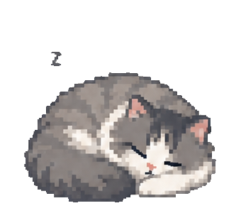

# Minimal Cat Pet / 猫咪桌宠



一个极简、离线、透明背景的桌面猫咪挂件，同时支持 macOS 和 Windows。

## 功能

- 透明背景、始终置顶
- 两帧轻量睡眠动画
- 鼠标拖动并记忆位置
- 右键关闭
- 多显示器范围校正，避免更换屏幕后猫咪消失
- 完全离线，不联网、不上传数据

## 平台

| 平台 | 实现 | 系统要求 |
| --- | --- | --- |
| macOS | 原生 Swift + AppKit | macOS 13+，Apple Silicon 与 Intel |
| Windows | PowerShell 5.1 + WPF | Windows 10/11 64 位 |

## 下载和安装

正式安装包发布在 GitHub Releases 中。

### macOS

解压后将 `猫咪桌宠.app` 拖入“应用程序”。由于个人发布版本使用 ad-hoc 签名，第一次启动请在 Finder 中右键选择“打开”。

从源码构建：

```zsh
chmod +x macos/build-universal.sh
./macos/build-universal.sh
```

构建结果位于 `macos/build/猫咪桌宠.app`。

### Windows

完整解压安装包后双击 `Install-CatPet.bat`。也可以直接运行 `Start-CatPet.bat` 使用便携模式。

详细说明见 [Windows README](windows/README.md)。

## 项目结构

```text
macos/      Swift/AppKit 源码、资源与 Universal 2 构建脚本
windows/    PowerShell/WPF 源码、安装与卸载脚本
scripts/    跨平台发布包生成脚本
.github/    macOS 编译与 Windows 语法验证工作流
```

## 安全与隐私

程序没有网络请求、统计、自动更新或用户数据上传。Windows 启动器使用 `ExecutionPolicy Bypass` 仅运行同目录中的本地 `CatPet.ps1`；安装不需要管理员权限。

## 授权

当前仓库未附带开源许可证，默认保留全部权利。在添加明确许可证前，代码公开仅代表可查看源代码。

---

Minimal Cat Pet is a tiny offline desktop companion for macOS and Windows. It stays on top, animates two sleeping frames, remembers its position, and makes no network requests.
